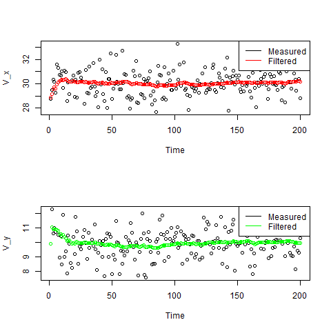

# Kalman filtering in Golang

[](https://github.com/konimarti/kalman/blob/master/LICENSE)
[](https://godoc.org/github.com/konimarti/kalman)
[](https://goreportcard.com/report/github.com/konimarti/kalman)

```go get github.com/konimarti/kalman```

## Usage
```go
	// create matrices and vectors
	...

	// create Kalman filter
	filter := kalman.NewFilter(
		X, // initial state (n x 1)
		P, // initial process covariance (n x n)
		F, // prediction matrix (n x n)
		B, // control matrix (n x k)
		H, // measurement matrix (l x n)
		R, // measurement errors (l x l)
	)

	// get measurement (l x 1) and control (k x 1) vectors
	..

	// apply filter
	filtered := filter.Apply(measurement, control)
}
```

### Results



### Examples

See more examples [here](example/car/car.go).

## Credits

This software package has been developed for and is in production at [Kalkfabrik Netstal](http://www.kfn.ch/en).
