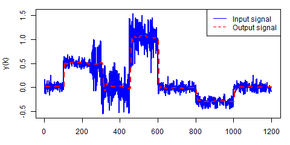

# Adaptive Kalman filtering in Golang

[](https://github.com/konimarti/kalman/blob/master/LICENSE)
[](https://godoc.org/github.com/konimarti/kalman)
[](https://goreportcard.com/report/github.com/konimarti/kalman)

```go get github.com/konimarti/kalman```

* Adaptive Kalman filtering with Rapid Ongoing Stochastic covariance Estimation (ROSE) 

* A helpful introduction to how Kalman filters work, can be found [here](https://www.bzarg.com/p/how-a-kalman-filter-works-in-pictures/).

* Kalman filters are based on a state-space representation of linear, time-invariant systems:

	The next state is defined as
	```math
	 x(t+1) = A_d * x(t) + B_d * u(t) 
	```
	 where A_d is the discretized prediction matrix and B_d the control matrix. 
	 x(t) is the current state and u(t) the external input. The response (measurement) of the system is y(t):	 
	```math
	 y(t)  = C * x(t) + D * u(t) 
	```

## Using the standard Kalman filter
```go

	// create filter
	filter := kalman.NewFilter(

		lti.Discrete{
			Ad, // prediction matrix (n x n)
			Bd, // control matrix (n x k)
			C,  // measurement matrix (l x n)
			D,  // measurement matrix (l x n)
		},

		kalman.Noise{
			Q, // process model covariance matrix (n x n)
			R, // measurement errors (l x l)
		}

	)

	// create context
	ctx := kalman.Context{
		X, // initial state (n x 1)
		P, // initial process covariance (n x n)
	}

	// get measurement (l x 1) and control (k x 1) vectors
	..

	// apply filter
	filteredMeasurement := filter.Apply(ctx, measurement, control)
}
```

### Results with standard Kalman filter


See example [here](example/car/car.go).

### Results with Rapid Ongoing Stochasic covariance Estimation (ROSE) filter



See example [here](example/rose/rose.go).

## Credits

This software package has been developed for and is in production at [Kalkfabrik Netstal](http://www.kfn.ch/en).
